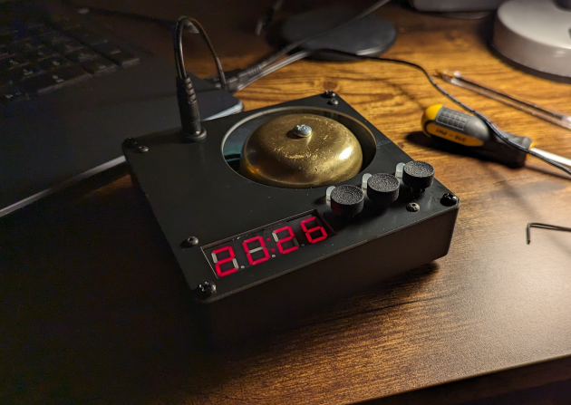

# Alarm clock with a real bell

These are the design files for a simple three-button alarm clock.

- `3d`: FreeCAD files for custom-fabricated parts
- `firmware`: code that runs on the clock Arduino
- `pcb`: KiCad files for the clock motherboard
- `top_plate`: KiCad files for the "front panel"

### Using the clock

#### Turning alarms on/off

Next to the time display, there are three buttons, each with an LED above it
associated with one of the three possible alarms.

A short press on these buttons cycles between three alarm modes for each of the
three alarms: alarm (and LED) off; single-chime mode (LED glows red); continuous
chime mode (LED glows green).

#### Setting the time

Pressing the first two buttons (i.e., left and middle button) simultaneously,
the time display begins flashing, signifying we're now in time setting mode. The
left button increments hours, the middle button increments minutes (resetting
seconds whenever it is pressed), and the right button is the "enter" button,
accepting the new time value.

#### Showing seconds

Pressing the middle and right buttons simultaneously, the display changes from
the usual HH:MM to MM:SS for five seconds.

#### Offset correction

The clock crystal is not perfect, and can be either fast or slow. To correct for
that, it is possible to either add or drop seconds periodically.

To enter the offset correction mode, press all three buttons simultaneously. The
display begins flashing very quickly, signifying we're in offset correction
mode. Left decrements the value, the middle button increments the value, and the
right button accepts the value.

The meaning of the offset value is as follows. For positive values, the time is
moved forward by a second every 433 minutes multiplied by the value. For
negative values, the time is moved backwards (i.e., the clock is slowed down) by
one second every 433 minutes multiplied by the absolute value of the offset
correction setting.

For example, if the offset correction value is set to -5, this means that every
5 times 433 minutes (approx 72.17 hours) a second is lost.
